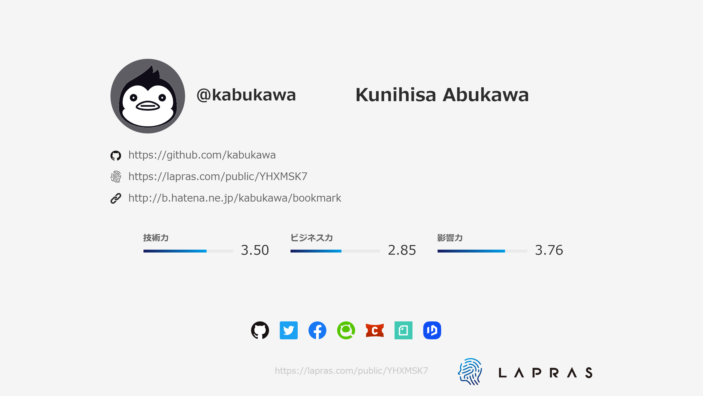

# 現場で使うVS Code

2020年12月18日(金)


---

## 今日話すこと

* 拡張機能については話しません。
* Windows環境を想定してます。
* 特定範囲の人にとってはあるあるだと思います。

---

## 自己紹介



---

## VS Code使ってますか

* 拡張機能便利ですよね
* 様々な機能が追加できて、色々な目的で使える
* 単なるエディタというより環境


---

## だがしかし

* 客先で開発をしていると、VS Code入れられない場合もある
* 拡張機能を入れられない場合もある
    * 勝手にインストール禁止
    * そもそもネットに繋がってない


---

## VS Codeの無い世界

* メモ帳でシステム開発とかやりたくない。
* せめて、VS Codeだけでも入れたいんじゃ！
* 拡張機能は、、、入れたいけど無理、みたいな。
* バージョン管理のために git も入れたいんじゃ！


---

## 現場で説得

* お金かかりません。エディタです。
    * ということで最低限の開発環境確保。
    * どこの馬の骨とも、え、マイクロソフト製なの？じゃぁいっか。
* Gitも必要なんっすよね。
    * VS Code入れるとgitも必要になるので。
    * バージョン管理を進めるきっかけ。
    * け、決して個人の趣味とかじゃないんだから！


---

## 拡張を入れなくてもできること

* ファイルの新規作成/更新/削除/名前変更など
* Gitによるバージョン管理(要gitコマンド)
* 高機能な編集機能(マルチカーソル)
* 画面分割、タブ切り替えによる複数ファイル編集
* ファイル内検索/grep
* 統合ターミナル
* Markdownのプレビュー
* Javascriptのデバッグ

などなど

---

## あれ？

結構素のVS Codeでも色々できるじゃん。

* 色々不自由のある現場でも活かせる
* 単純に便利
* これって最高では？


---

## 実際に使っている設定

デフォルトから設定を変えているものを紹介。

* [設定] 画面の開き方
    * Ctrl + ,のショートカット
    * File > Preferences > Settings
    * サイドメニューの歯車アイコンから「設定」を選択

---

### 文字コード自動判定

* VS Codeのデフォルトは utf-8。
* だけどWindowsではShift-JISのファイルもあるので文字化けせずに編集したい。

1. 検索欄に files.autoGuessEncoding  を打ち込み、チェックボックスを ON にする。
2. もしくはsettings.jsonで以下の項目を記述する。

```json
"files.autoGuessEncoding": true,
```

---

### 自動判定だけど

* うまく判定できないこともある。
* JIS(iso-2022-jp)は変換できない。
    * 今どきJISのファイルなんて無いでしょ？(いや、有るんですよ。。。)
    * GitBashに付属のvimで！(本末転倒)
    * GitBashに付属のiconv(だ～か～ら～)
* utf-8 with BOMで保存するとExcelで読めるcsv作れる。これ、豆な。


---

### 改行コード

* サーバーとのやり取りもあるので、改行コードは LF に。

1. 検索欄に files.eol を打ち込み、ドロップダウンリストで "\n" を選択してデフォルトの改行コードをLFに変更する。
2. もしくはsettings.jsonで以下の項目を記述する。

```json
"files.eol": "\n",
```

---

### 別に改行コードは変えなくても

* サーバーにファイルを持っていったときに ^M を見たくない。
* 今どき、メモ帳でも 改行コード LF のファイルを扱える。
* だったらどっちかに統一したほうが安心。


---

### 統合シェル

* VS Codeの統合ターミナルをGitBashに。

* 検索欄に terminal.integrated.shell.windows を打ち込み、settings.jsonで編集 で編集画面表示。以下の内容を記述する。

```json
"terminal.integrated.shell.windows": "C:\\Program Files\\Git\\bin\\bash.exe",
```

---

### PowerShellじゃないの？

* Git for Windowsをインストールすると一緒に入る。
* WSLが使えない32bit Windows環境でbash使いたいなら
* WSL環境と設定ファイルを共用できる(俺得)
* 俺はbashが使いたい。


---

## コマンドライン

[コマンドライン起動オプション](https://code.visualstudio.com/docs/getstarted/tips-and-tricks#_command-line)

* 現在のディレクトリでコードを開く

```
code .
```

* 特定の行と列でファイルを開く file：line [：character]

```
code --goto package.json:10:5
```

---

### 差分

* 差分エディタを開く

```
code --diff <file1> <file2>
```

* .gitconfigに登録して、gitコマンドのdiffのときにVS Codeを使う。

```ini
[diff]
    tool = vscode
[difftool "vscode"]
    cmd = code --wait --diff $LOCAL $REMOTE
```

---

### リセット

* すべての拡張機能を無効にして起動

```
code --disable-extensions .
```

* 設定などを全て削除
    1. %APPDATA%\Code を削除
    2. %HOMEDRIVE%%HOMEPATH%.vscode を削除

---

## まとめ

* VS Code、拡張機能が無くても結構できる子
* GitBashと組み合わせるとWSLが無くてもそれなりに使える。
* VS Codeを導入することで、少しでも現場の開発が楽しくなると良いですね。


