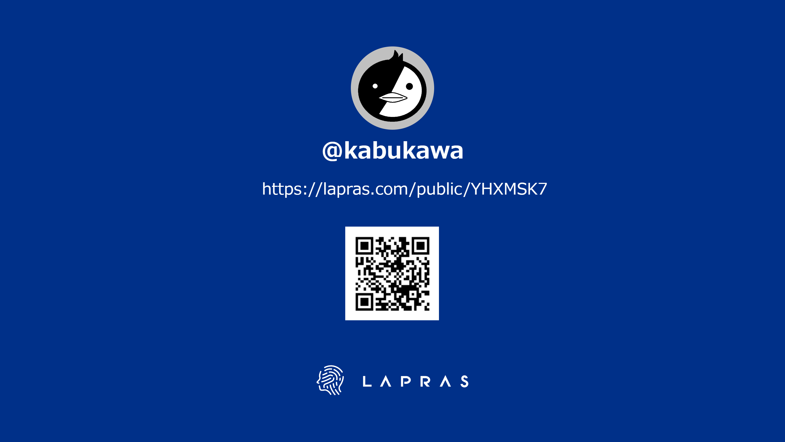
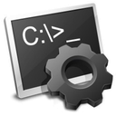
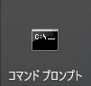
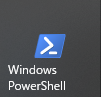
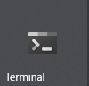

# 令和につかう Terminal

Windows編

吉祥寺.pm 25 LT

---

## 誰？

---

## さて、突然ですが

Windows でターミナル、何を使ってますか？

---

## コマンドプロンプト

* 窓の中のDOS。
* DOSからの改善も有るが、大きくは変わらない。
* 良く言えばシンプル、悪く言うとできることが少ない。
* 今はcurlもsshも動く。

---

## Power Shell

* 新世代のコマンドシェルを目指して開発された。
* DOSと決別することでモダンな設計に。
* バイバイ VBScript
* 今はWindows以外でも使える。

---

## WSL

* Windowsの中でLinuxが動く。
* VMより軽く、互換性も高い。
* Windowsとの親和性。
* Windowsの開発環境が大きく変わった。

---

### この3つに共通すること

---

## ベースのターミナル

* 基本的にはコマンドプロンプトベース
* できることは大きくは変わらない
* 今後あまり大きく改良されていくことはない
* 令和の時代に平成のターミナルを使い続ける？

---

## そこで

<big>Windows Terminal</big>

---

## Windows Terminal

[Windows Terminal](https://github.com/microsoft/terminal) (GitHub)

* MicrosoftがOSSとして開発
* 2020年5月20日にGA (令和に入ってから誕生)
* Microsoft Storeから入手、インストール可能
* 毎月リリース(開発2W、品質と安定1W、リリース1W)

---

## 変わったところ(1)

* 複数ターミナルを扱うことが可能
* タブ切り替え、マウス等での順序入れ替え
* ウィンドウ分割(別ターミナルを実行可能)
* コマンドパレット、ショートカットキー

---

## 変わったところ(2)

* GitBash等、標準ターミナル以外も指定可能
* ファイルの書き換えによる設定変更
* 背景画像が指定できるように
* ウィンドウの透明化の方法

---

## ターミナルを統一

バラバラだったターミナルを一つに

* 操作性(ショートカットキー)
* 設定方法
* 見た目(フォント、テーマ)

---

## つまりは

<big>Windowsのターミナルも 
楽しく使えるようになる！</big>

---

## 2.0に向けて

2021-05-31にリリース予定

---

## 提供が予定されている機能

* 設定UI
* コマンドパレット
* タブ切り離し
* クリック可能なリンク
* デフォルト端末
* 全体的なテーマのサポート

詳細は [2.0シナリオ](https://a4fhyacqjlgge3ajkribfidtye--github-com.translate.goog/microsoft/terminal/blob/main/doc/terminal-v2-roadmap.md#20-scenarios) を参照。

---

## まとめ

Windows Terminalを使うことで

* モダンなターミナルが手に入る。
* 見た目に楽しく、使いやすく。
* ターミナルのニューノーマル
* 但しWindowsに限る

---

<b><big>新しい 
窓がもたらす 
新世界 
やってきたのは 
「笑ってお仕事」 
</big></b>

ご清聴、ありがとうございました。