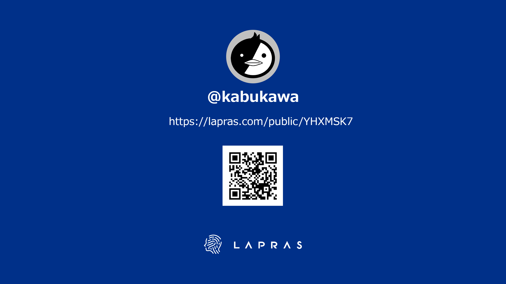

# 古の環境と戦う話
(但し勝てるとは言っていない)


吉祥寺.pm 26 LT

---

## 誰？



---

## 現場で開発をしていると

* いろんな環境🤖に出会う
* 環境に応じて戦わなければならない
* 武器⚔️は自分で用意するしか無い
* またもクライアントはWindows

---

## この話の現場では

|名前|サポート期限|
|:-------|:------------|
|CentOS 5.11|2020年11月30日|
|PHP 5.6 |2019年01月10日|
|MySQL 5.6|2021年02月5日|

---

全部サポート切れてるやん😳

---

## 若者の声

VS Codeのリモート接続🌏ができないんですが

* OSが古いのでCode Serverが動かない
* 若者はGUIエディタしか使えない
* 黒い画面💻で編集とか無理です
* これが現実の現場

---

### win-sshfsで解決だ！

* sshプロトコルでファイル操作
* sshでログインできるサーバーなら使える
* サーバー側の変更不要
* クライアント側は簡単インストール
* Windowsならドライブ割当出来る

---

### インストールとか設定

* [Dokany](https://github.com/dokan-dev/dokany)
* [win-sshfs](https://github.com/feo-cz/win-sshfs)
* 設定手順などは [こちら]() を参照。
* エクスプローラーでコピー/移動/削除
* VS Codeで快適編集

---

## 若者の声

VS Codeで日本語が文字化け👻するんですが

* 文字コードが euc-jp
* MySQLの文字コードも ujis
* euc-jpとかujisってなんですか？
* そもそもなんで名前が違うんですか？

---

### 自動判定設定だ！

VS Codeの文字コード自動判定有効化

Settings.json で以下の項目を探して trueにする。<br>
(最新の「設定」画面ではチェックボックスになっているので ON にするだけでOK)

```json
"files.autoGuessEncoding": true
```

* VS Codeはこの機能がデフォルトOFF
個人的には何も考えずON一択。

---

### 念の為

全ソースの文字コード調べてみたら。。。

```
find . -type f -print | \
egrep -v '\.(git|svn|png|jpg|gif|aux)' | \
xargs -n1 -t nkf -g > aaa 2>&1
cat aaa | \
sed -e 'N;s/\n/,/g' -e 's/nkf -g \.\///g' > front_charset.csv
```

`euc-jp` 以外にも `utf-8`、`shift-jis`、`iso-2022-jp`
が有ってワロタ(ワロエナイ)

ちなみにVS Codeは `iso-2022-jp` に対応してないです。{.fragment .fade-right}

---

## 若者の声

Docker🐳で開発できないんですか？

* Docker環境は作ろうとした形跡は有る
* これでローカルで開発が捗るのでは？
* しかしdocker-composeするとエラーが
    * yumリポジトリが無い

---

### ミラーを探して構築だ！

リポジトリ定義ファイル `yum.repos.d/CentOS-Base.repo` を修正。

(ググると以下のような対応が結構見つかる)

修正前

```
baseurl=http://vault.centos.org/5.11/os/$basearch/
```

修正後

```
baseurl=https://archive.kernel.org/centos-vault/5.11/os/$basearch/
```

これでyum update/install できるようになった。

---

### しかし、、、

* archive.kernel.org は重いので、タイムアウトでイメージ作成が成功しない。
    * ちゃんとミラーサイトを指定しましょう。
```
baseurl=http://ftp.iij.ad.jp/pub/linux/centos-vault/5.11/os/$basearch/
```
* Docker Desktop for Windows のオプションで
`Use the WSL 2 based engine` がONになっていると古いカーネルのLinux OSが起動できない問題が有るので、起動できなかったらこれをOFFにする。


---

## 若者の声

git push 🐱しても反映されないんですが

* ソースはGitHubのリポジトリにpush
* svnは辞めたと聞いていた
* なんとサーバーへのデプロイはsvn
* というか基本はsvnだった
* 聞いてないよー

---

### 突如登場するjenkins

* gitから反映は無理くり
* Jenkinsタスクで反映
* svn→git は自動で実行
* git→svn は手動実行
* そして事故は発生する。。。

---

反映順序を間違えて、消えた履歴、、、

これだけは解決できていないです。{.fragment .fade-right}

To be continued.🎬{.fragment .fade-right}

---

## まとめ

* 問題解決がエンジニアの仕事。
* 古いのではない。枯れているのだ。
* 誰かが通ってきた/通るかもしれない道。
* きっとどこかにヒントは有る。
* そういうのを楽しむのも大事。

---

🃏配られたカードで

勝負するっきゃないのさ

それがどうゆう意味であれ

---

一句

古くても

なんとかするのが

仕事です