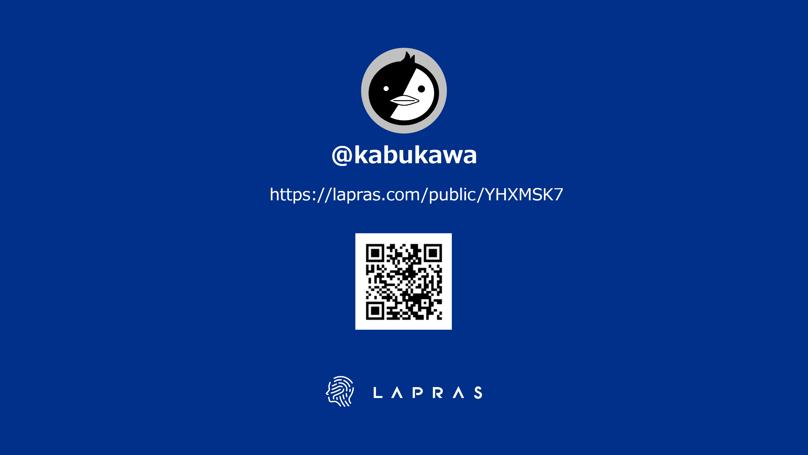

# 転職した話

吉祥寺.pm 27 LT

---

## 誰？

---

## 6月に転職しました

* 💴金融系のスタートアップです。
* 👴おっさんでも転職できました。
* 🎙️今日はその話をします。

---

## ちなみに今日は

* 🍰53回目の誕生日です。(をい {.fragment .fade-right}

---

## どれくらいの会社を受けた？

* 🗓️決まるまで10ヶ月くらい。
* 👨‍⚖️カジュアル面談 6社。
* 😃2次面接まで進んだ会社 4社。{.fragment .fade-right}
* 😊最終面接まで進んだ会社 2社。{.fragment .fade-right}

---

## 大変だった？

* 👋カジュアル面談までは結構声がかかる。
* 😇面接が進むにつれて結構大変。
* 😫おっさんなので期待値がかなり高い。{.fragment .fade-right}
* 😡途中で態度が変わる会社がある。{.fragment .fade-right}

---

## 一番大変だった会社

* ⛅目黒に有る外資系クラウドベンダー。
* ⚡面接3回(最終面接は1日で5人で各1時間ずつ)
* 📖英語で面接始まって詰んだ(英語はないって聞いていたのに。。。)　{.fragment .fade-right}
* 😭まぁ、落ちたんですけどね。{.fragment .fade-right}

---

## 大事だなと思ったこと

* 🔮何ができて、何ができないかをちゃんと伝える。
* 💎自分が何をしたいのかを伝える。
* 🎀違和感を感じたら断る勇気。{.fragment .fade-right}
* 📌無理はしない。でも、背伸びはする。{.fragment .fade-right}

---

## 転職を決めた理由

* 💘自分がやりたかったことに近かった。
* 🧡SESじゃない世界を見てみたかった。
* 💛大変そうだけど、なんか面白そうと思えた。{.fragment .fade-right}
* 💚一番自分を必要なんだろうな、と思えたから。{.fragment .fade-right}

---

## 転職して驚いたこと

* 💣ドキュメントがない。(ある程度予想はしていたが)
* 💣引き継ぎがちゃんとされていない。
* 💣開発者の社員が居ない。{.fragment .fade-right}
* 💣俺がインフラ担当リード。{.fragment .fade-right}

---

## 既に辞めたい？

* 😊意外にそうでもない。
* 😊毎日何かが起こるので、飽きる暇がない。
* 😊自分の知らないことにチャレンジし続けられるのは楽しい。
* 😊中の人はいい人が多い。

---

## 結論

* 🌞おっさんでも転職できるし、役に立てる。
* 🌀スタートアップ、大変だけど楽しい。
* 🌈とはいえ、スキルの足りなさはどうにもならないので、頑張るのは結構大変。{.fragment .fade-right}
* 💯どこまでいけるかわからないけど、頑張りたい。{.fragment .fade-right}

---

## 願い

エンジニア{.fragment .fade-right}

仲間がほしい{.fragment .fade-right}

よろしくね🌠{.fragment .fade-right}

---

ご清聴ありがとうございました！