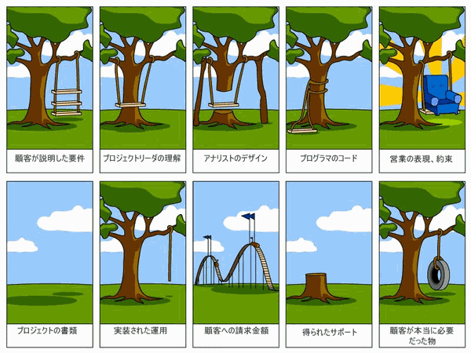

# 知識をUpdateし続けること

2021年11月26日(金)

---

## 今日話すこと

* おっさんエンジニアの生存戦略
* 知識アップデートの必要性
* 知識のアップデート方法
* どうなっていきたいか

---

## 自己紹介

---

## エンジニアの世界では

* 35歳定年説
* 新しい技術がどんどん出てくる
* 古いものも使われ続ける
* 総合的な問題解決力が問われる

---

## 生存戦略

* 知識を更新し続けないと生きていけない
* おっさんはだんだん仕事が無くなる
* 新しいことも古いことも(経験と知識)
* 何を売りに生きていくか

---

## つまりは

* (エンジニアは)経験だけで生きていけない
* 知識をアップデートし続ける必要がある
* 毎日勉強
* お金は必要

---

## とはいえ

* 専門知識やスキルで生きていくことは可能
* ただし、それは突き抜けたものが必要
* OSSに関わるなどの道もある
* 自分がどうなっていきたいか

---

## 情報をどう更新するか

* 取り敢えず今はネットがある
* 周りの人に聞くのはリモートだと難しい
* 書籍の情報は陳腐化しやすい
* 今あるものから吸収する力

---

## ソーシャルブックマーク

* 他の人が関心があることを知る
* トレンド、情報源の発見
* 取っ掛かりとしては取り組みやすい
* 玉石混交

---

## ソーシャルブックマークの例

はてなブックマーク

https://b.hatena.ne.jp/hotentry/all

---

## キュレーション

* 誰かが選んだ記事を纏めて公開
* ソーシャルブックマークよりは専門記事が見つけやすい
* 記事を探さなくて良い
* 取っ掛かりとしては取り組みやすい

---

## キュレーションの例

TechFeed

https://techfeed.io/categories/all

---

### 勉強会

* お互いの知識共有などを目的としたもの
* 誰か(人、企業)が提供している
* 多くの場合、無料
* 様々な勉強会が毎日開催されている

---

### 勉強会の例

connpass

https://connpass.com/

---

### 技術ブログ

* 誰か(人、企業)が提供している
* 書籍より更新が早い
* 玉石混交
* RSSリーダー

---

### ブログの例

Zenn

https://zenn.dev/

Facebook Reserch

https://research.fb.com/blog/

---

### Twitter

* 色々な情報が流れている
* 流れている情報そのものより人
* 新しい情報源を探す時
* 使い方を間違えると劇薬

---

### その他

ニュースサイト

https://www.publickey1.jp/
https://www.infoq.com/jp/

---

### とはいえ

* Google検索が実は一番役に立つこともある
    * 海外の情報を纏めて探せる
* 書籍は安定した情報源
    * 最近は技術同人誌というのもある
    * https://techbookfest.org/

---

### 続けるには

* 取り敢えず興味のあることを見つける
* 楽しく、気軽に
* 全部吸収しようと思わない
* できればアウトプットする

---

## まとめ

* 今はいろいろな情報や技術が無料で手に入る
* 生き続けるにはアップデートし続ける
* 仲間を見つける
* 最終的には楽しいにつなげる

---

## 宣伝

Redmine Japan vol.2

* 2022年2月25日(金) 10:00～18:00
* オンライン
* 参加無料

https://redmine-japan.org/vol-2/
